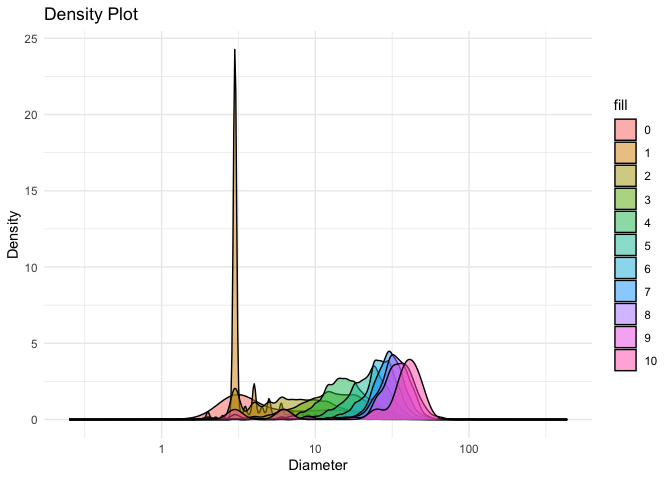

STAT545B Assignment B1 (Weiya Zhu)
================

# Exercise 1 Make a Function

In this exercise, I will make a function that is not complicated and
fortifying it.

``` r
# load the following packages
library(datateachr)
library(tidyverse)
```

    ## ── Attaching core tidyverse packages ──────────────────────── tidyverse 2.0.0 ──
    ## ✔ dplyr     1.1.3     ✔ readr     2.1.4
    ## ✔ forcats   1.0.0     ✔ stringr   1.5.0
    ## ✔ ggplot2   3.4.3     ✔ tibble    3.2.1
    ## ✔ lubridate 1.9.2     ✔ tidyr     1.3.0
    ## ✔ purrr     1.0.2     
    ## ── Conflicts ────────────────────────────────────────── tidyverse_conflicts() ──
    ## ✖ dplyr::filter() masks stats::filter()
    ## ✖ dplyr::lag()    masks stats::lag()
    ## ℹ Use the conflicted package (<http://conflicted.r-lib.org/>) to force all conflicts to become errors

``` r
library(ggplot2)
library(testthat)
```

    ## 
    ## Attaching package: 'testthat'
    ## 
    ## The following object is masked from 'package:dplyr':
    ## 
    ##     matches
    ## 
    ## The following object is masked from 'package:purrr':
    ## 
    ##     is_null
    ## 
    ## The following objects are masked from 'package:readr':
    ## 
    ##     edition_get, local_edition
    ## 
    ## The following object is masked from 'package:tidyr':
    ## 
    ##     matches

The function I made is a density_plot function since I used to plot many
density plot in Mini Data Analysis Project.

``` r
density_plot <- function(data, x, fill) {
  #make sure there is no NA value
  x_val<- x[!is.na(x)]
    if(!is.numeric(x_val)) {
      stop('Please make sure x is a numeric vlaue')
    }

  ggplot(data = data, aes(x = x)) +
    geom_density(aes(fill = fill), alpha = 0.5) +
    labs(title = "Density Plot", x = x, y = "Density") +
    scale_x_log10() +
    theme_minimal()
}
```

# Exercise 2: Document your Function

In this Exercise 2, I will document the function using roxygen2 tags

``` r
density_plot <- function(data, x, fill) {
  x_val<- x[!is.na(x)]
    if(!is.numeric(x_val)) {
      stop('Please make sure x is a numeric vlaue')
    }

  ggplot(data = data, aes(x = x)) +
    geom_density(aes(fill = fill), alpha = 0.5) +
    labs(title = "Density Plot", x = x, y = "Density") +
    scale_x_log10() +
    theme_minimal()
}
#' 1. density_plot
#' 2. @description The density_plot function creates a density plot wiht alpha=0.5 based on the given inputs, dataset, x, and fill values, using ggplot2.
#'  This function can be used as a visualization tool to represent the distribution of a continuous numeric variable (x) across multiple fills.
#' 3.@param data The input dataset
#' @param x A continuous numerical variable in the dataset, it is one of the varibale being investigated
#' @param fill A variable in the dataset, it is one of the varibale being investigated
#' 4.@return A density plot with value of x in x-axis across different fills and denisity as the y-axis
```

# Exercise 3: Include examples

I will demonstrate the usage of the density_plot function with a few
examples.

**Example 1**

``` r
#filter the vancouver_trees datatset by filtering out the diameter column with diameter>0 to avoid the warning message
filtered_dataset <- vancouver_trees %>%
  filter(diameter > 0)

#call the density_plot function to plot a density plot, which represents the distribution of the tree diameter across different root_barrier. 
density_plot( data=filtered_dataset, x=filtered_dataset$diameter, fill=filtered_dataset$root_barrier)
```

<!-- -->

**Example 2**

``` r
#Use the filter_dataset above to filter out the diameter column with diameter>0
#Now, set the height_range_id column as a categorical column to make the graph more useful
filtered_dataset$height_range_id <- factor(filtered_dataset$height_range_id)

#call the density_plot function to plot a density plot for diameter versus height_range_id, where the different height_range_id are shown as fills
density_plot( data=filtered_dataset, x=filtered_dataset$diameter, fill=filtered_dataset$height_range_id)
```

<!-- -->

**Example 3**

``` r
#call the density_plot function to plot a density plot for radius_mean versus the results of diagnosis. 
#It is clear from the graph that when radius_mean ranges around 15, the density of the diagnosis B is extremely high,
#whereas when the radius_mean ranges from 17-20, the density of the diagnosis M is very high.
density_plot( data=cancer_sample, x=cancer_sample$radius_mean, fill=cancer_sample$diagnosis)
```

<!-- -->

# Exercise 4: Test the Function

Running examples to check whether the function is working as expected.

**Test 1**

``` r
test_that("Test 1:Function creates a ggplot",{
  epected_val <- density_plot(filtered_dataset, filtered_dataset$diameter, filtered_dataset$root_barrier)
  expect_is(epected_val,"ggplot")
})
```

    ## Test passed 🥳

**Test 2**

``` r
test_that("Test 2: Function can only have continuous numerical x values", {
  expect_error(density_plot(filtered_dataset, filtered_dataset$root_barrier, filtered_dataset$diameter))
})
```

    ## Test passed 🥇

**Test 3**

``` r
test_that("Test 3: Function only takes three inputs", {
  expect_error(density_plot(filtered_dataset, filtered_dataset$root_barrier, filtered_dataset$diameter, filtered_dataset$height_range_id))
})
```

    ## Test passed 🥳
